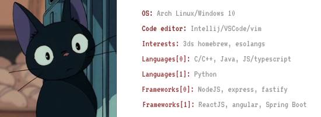

<h1 align="left">Olá! | Hello there 👋
</h1>

  
  - 🔭 I’m currently working with [VivaMoveis](https://vivamoveis.com/) at [Ayty](https://ayty.org)
  - 📑 Student at [Federal University of Paraíba (UFPB)](https://ufpb.br)
  - 💬 Ask me about **RISC-I**, **3ds homebrew**, **fullstack development**
  - 🎲 Hobbies: Photography 📷 | Volleyball 🏐
  - 🌳 Tech I'm currently using:
    
    

      
Code editors

      - VSCode
      - Vim
    

    

      
Languages
    
      
    - C++
    - Javascript
    - Typescript
    - Java
    

    

      
Computer/OS

      - Notebook: Lenovo Legion Slim 5i
      - OS: Windows 11/Arch Linux
    

    

      
Frameworks

      - ExpressJS
      - Fastify
      - ReactJS
      - Spring

    

  - 🌱 I’m currently learning:
    
    

      
Backend

  
    - Spring
    - ExpressJS
    - Fastify
    - C++ (http)
      
    

    

      
Frontend (click to expand)

  
    - Typescript
    - ReactJS
    - Angular
      
    

        

    

      
Other

  
    - homebrew (3ds, wii)
    - C++
    - Low level coding
      
    

  - ⚡ Fun fact: I created those projects:
    

      
Projects

  
    - [Esonaldo Pereira](https://github.com/710lucas/esonaldo-pereira): An [esolang](https://esolangs.org/wiki/Esoteric_programming_language)
    - [RISC-I emulator](https://github.com/710lucas/RISC-I-Emu): A simple RISC-I emulator
    - [RISC-I compiler](https://github.com/710lucas/RISC-I-Compiler): A compiler for the RISC-I emulator
    - [Web RISC-I Compiler & Code editor](https://710lucas.github.io/RISC-I-Compiler-web/public): A simple code editor and compiler made in html, css and JS
      
    

  

 
 

<h2>
  📊 Stats 
</h2>

  
  

  

 
 

    
    
    
    
    
    
    
    
    
    
    
    
    
     
    
    
    
     
     
    
     
     

        

<!---
LucasPB710/LucasPB710 is a ✨ special ✨ repository because its `README.md` (this file) appears on your GitHub profile.
You can click the Preview link to take a look at your changes.
--->
