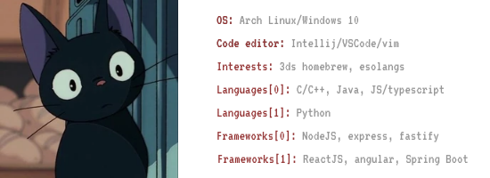

<h1 align="left">Hello there 👋
</h1>

  
🇧🇷 🇺🇸 🇫🇷 

  
  - 🔭 Founder and Managing Director at [Uaná.Tech](https://uana.tech/)
  - 🔭 I’m currently working with [VivaMoveis](https://vivamoveis.com/) at [Ayty](https://ayty.org) as a **Fullstack developer**
  - 🔭 Internship at [LedgerTec](https://ledgertec.com.br/) as a **Fullstack developer**
  - 📑 Student at [Federal University of Paraíba (UFPB)](https://ufpb.br)
    

      
🌍 Cybersecurity WCUC - UK

      - Exchange program: Paraíba sem fronteiras
      - Studied for 4 months

    

    
  - 💬 Ask me about **RISC-I**, **3ds homebrew**, **fullstack development**, and **AI Orchestration**
  - 🎲 Hobbies: Photography 📷 | Volleyball 🏐

---

  ## 🛠️ Skills & Toolbox

  

    
💻 Core Stack (Backend & Frontend)

    <ul>
      <li><b>Languages:</b> TypeScript, JavaScript, Java, Python, C++</li>
      <li><b>Frameworks/Libs:</b> Node.js (ExpressJS, Fastify), ReactJS, Next.js, Angular, Spring Boot</li>
    </ul>
  

  

    
⚙️ Infrastructure, Homelab & Tools

    <ul>
      <li><b>OS/Environments:</b> Linux (Fedora/Arch), Windows 11</li>
      <li><b>Monitoring & Ops:</b> Docker, Zabbix, SNMP</li>
      <li><b>Server "Sinapse":</b> A homelab running Dockerized services:
        <ul>
          <li>Minecraft Server, GitHub Actions Runner, Personal NAS, and Databases</li>
        </ul>
      </li>
    </ul>
  

---

## 🏆 Beyond the Code (Achievements & Involvement)

- 🚀 **Hackathon Oceano Digital (2026):** Developed **EcoTurPB**, a digital platform focused on sustainable tourism and environmental preservation.
- 🎓 **UFPB Symposium (2026):** Attended the "Technologies for Integrating Sustainable Development" symposium.
- 🛡️ **Cybersecurity Residency - WCUC, UK (2024):** Completed an international academic residency at Warwickshire College. Focused on **Computer Networks and Cyber Security** as part of the "Paraíba sem Fronteiras" program.
- 🌍 **Ambassador of "Paraíba sem Fronteiras":** Acted as an ambassador for the state exchange program, representing the initiative during and after the residency in the United Kingdom.

---

## ⚡ Featured Projects

  

    
Click to expand

    <ul>
      <li><a href="https://github.com/710lucas/esonaldo-pereira"><b>Esonaldo Pereira:</b></a> An esoteric programming language (esolang).</li>
      <li><a href="https://github.com/710lucas/RISC-I-Emu"><b>RISC-I Emulator:</b></a> A functional emulator for the RISC-I architecture.</li>
      <li><a href="https://github.com/710lucas/RISC-I-Compiler"><b>RISC-I Compiler:</b></a> A dedicated compiler for the RISC-I ecosystem.</li>
      <li><a href="https://710lucas.github.io/RISC-I-Compiler-web/public"><b>Web RISC-I Compiler:</b></a> A web-based code editor and compiler built with HTML/CSS/JS.</li>
      <li><a href="https://github.com/710lucas/Gest-o-de-funcionarios-GISI"><b>Employee Management (GISI):</b></a> A management system designed for organizational staff administration.</li>
    </ul>
  

---

  
 
 

<h2>
  📊 Stats 
</h2>

    
  

 
 

<!--      -->
    
    
    
    
    
    
    
    
    
    
    
    
     
    
    
    
     
     
    
     
     

        

<!---
LucasPB710/LucasPB710 is a ✨ special ✨ repository because its `README.md` (this file) appears on your GitHub profile.
You can click the Preview link to take a look at your changes.
--->
